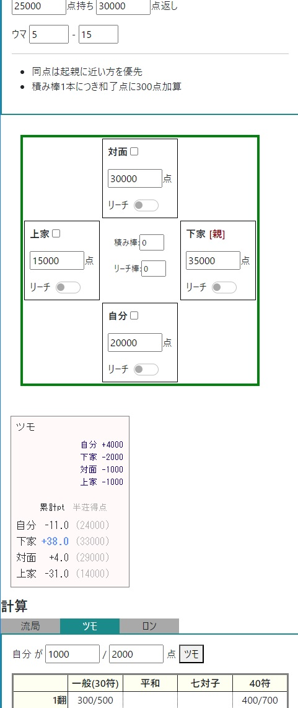

# name

alla

## Overview

麻雀の最終局における点数計算

## Environment

- Chrome (112.0.5615.138)
- Vue.js (3.1.5)

## Usage

- https://orion78cvz.github.io/alla/

## Description

TODO:
- 立直、流局時聴牌の計算
- 目的順位からの和了点計算

## Author

Orion78cvz (Okinawa Bunmei)

## Licence

This project is licensed under the terms of the MIT license.
